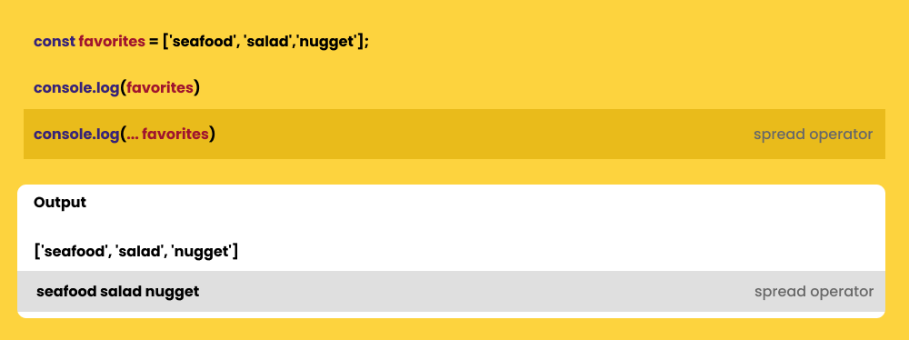

# Spread Operator

### Apa Spread Operator ?

> salah satu fitur menarik dari ES6 untuk membantu pengelolaan array menjadi lebih mudah

> sesuai namanya 'spread', digunakan untuk menyebarkan/membongkar nilai array atau lebih tepatnya iterable object menjadi beberapa elemen.

### Syntax Spread Operator

    ```
        (...)
    ```

-   contoh :



Terlihat perbedaannya? Mengapa bisa demikian? Spread operator bekerja seperti meleburkan nilai array menjadi beberapa elemen sesuai panjang nilai array-nya

spread operator dapat digunakan menggabungkan dua buah array ke dalam array baru
jika tidak menggunakan spread operator hasilnya akan seperti ini :

```

const favorites = ["Seafood", "Salad", "Nugget", "Soup"];
const others = ["Cake", "Pie", "Donut"];

const allFavorites = [favorites, others];

console.log(allFavorites);

--- output --------------------------------
[
  [ 'Seafood', 'Salad', 'Nugget', 'Soup' ],
  [ 'Cake', 'Pie', 'Donut' ]
]
-------------------------------------------
```

> nilai array tidak tergabung, justru allFavorites menjadi array baru yang menampung dua array di dalamnya.

Namun berbeda jika menggunakan spread operator

```
const allFavorites = [...favorites, ...others];
console.log(allFavorites);

--- output ---------------------------------------
[ 'Seafood', 'Salad', 'Nugget', 'Soup', 'Cake', 'Pie', 'Donut' ]
---------------------------------------------------
```
